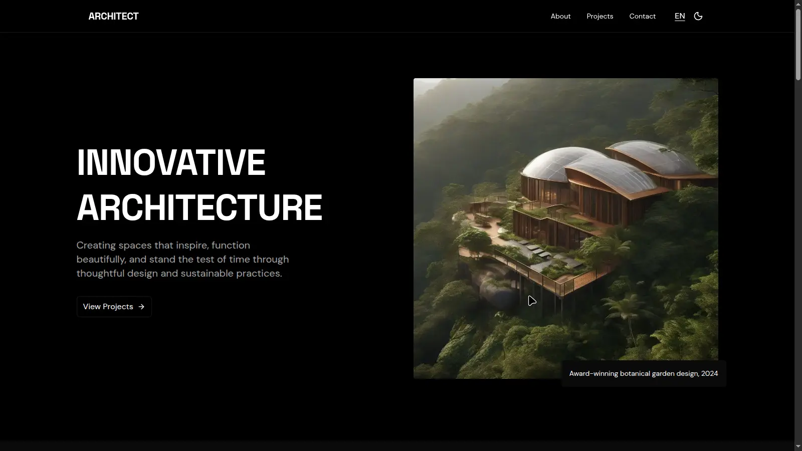

# **ARCHITECT**  
*A modern architectural portfolio built with Astro.*



---

## **📌 Overview**
ARCHITECT is a minimalist and elegant portfolio for showcasing architectural projects. Built with **Astro**, it focuses on **performance, SEO optimization, and responsive design**, creating a smooth experience across devices.

---

## **✨ Features**
- ⚡ **Astro v5** for fast static rendering
- 🎨 **Responsive & Minimalist UI** with **TailwindCSS**
- 🌓 **Dark Mode** based on system preferences
- 🌍 **i18n Support** (English & Spanish)
- 🖼️ **Image optimization** with Astro Image tools
- 📄 **SEO Ready** (meta tags, canonical URLs, sitemap, robots.txt)
- 🗂️ **Project Detail Pages** generated from Markdown content
- 🔍 **Open Graph & JSON-LD Structured Data**

---

## **🛠️ Tech Stack**
- **Astro**: Static site generator
- **TailwindCSS**: Utility-first CSS framework
- **TypeScript**: Type safety
- **i18n**: Custom implementation for language toggle
- **Markdown**: Content for projects
- **Vercel**: Deployment platform

---

## **📂 Project Structure**
```
/
├── public/             # Static assets (favicon, images)
├── src/
│   ├── components/     # UI components (Nav, Footer, etc.)
│   ├── layouts/        # Base layout
│   ├── pages/          # Routes (Home, Project Detail)
│   ├── projects/        # Markdown files for projects
│   └── styles/         # Global styles
├── astro.config.mjs    # Astro configuration
└── package.json        # Dependencies and scripts
```

---

## **🚀 Getting Started**

### **1. Clone the repository**
```bash
git clone https://github.com/yourusername/architect.git
cd architect
```

### **2. Install dependencies**
```bash
npm install
```

### **3. Run the development server**
```bash
npm run dev
```
Open **http://localhost:4321** in your browser.

---

## **📦 Build for Production**
```bash
npm run build
npm run preview
```

---

## **🖼️ Content Management**
Projects are stored as **Markdown files** in `src/projects/` with the following **frontmatter structure**:

```yaml
---
title: "Villa Moderna"
subtitle: "Residential • Barcelona, Spain • 2024"
hero: "/images/villa-moderna/hero.jpg"
description: "A minimalist residential project..."
# More fields like process, gallery, details, reflection
---
```

Use the provided prompt system to generate realistic projects with AI.

---

## **🔐 SEO & Performance**
- **robots.txt** configured
- **Sitemap** auto-generated by Astro
- **Meta tags & canonical URLs** via Layout
- **Structured Data (JSON-LD)** for rich search results

---

## **🌗 Dark Mode**
Automatically adapts to **system preferences**, or you can implement a manual toggle if needed.

---

## **🌐 i18n (Language Toggle)**
Languages supported: **English (en)**, **Spanish (es)**.  
Implemented via a simple **toggle link** in the navigation:

```astro
<a href={changeLang}>
  {languages[lang]}
</a>
```

---

## License
This project is licensed under the [Creative Commons Attribution-NonCommercial 4.0 International License (CC BY-NC 4.0)](https://creativecommons.org/licenses/by-nc/4.0/).

